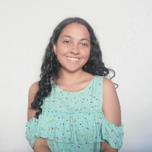

 

    

 

    <h1>Processamento de Linguagens 2024/25</h1>
    
Repositório para colocação dos TPC da Unidade Curricular de Processamento de Linguagens

 

    <h2>Aluna</h2>

<table align="center">
    <tr>
        <th><strong>Nome</strong></th>
        <th><strong>Número</strong></th>
    </tr>
    <tr>
        <td>Beatriz Salgado Fernandes</td>
        <td>A100602</td>
    </tr>
</table>

 

    

 
